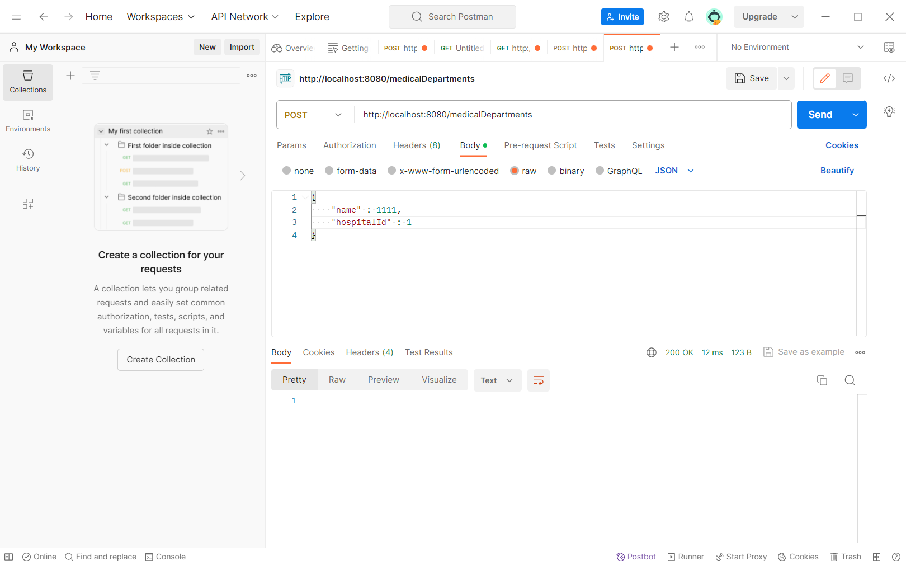
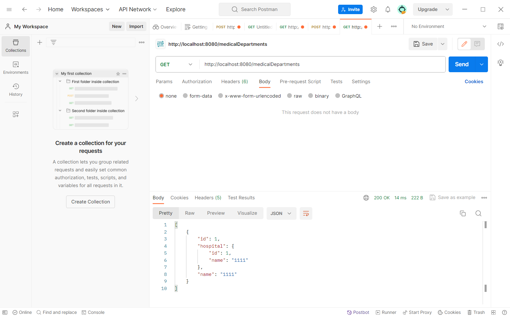
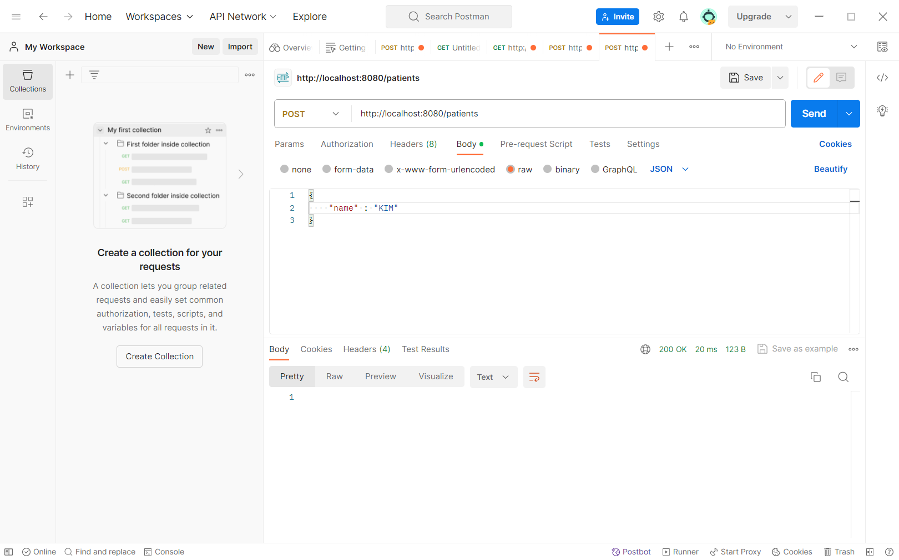
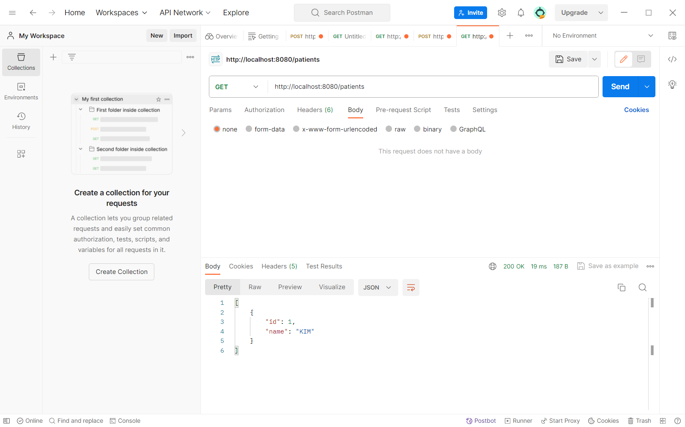
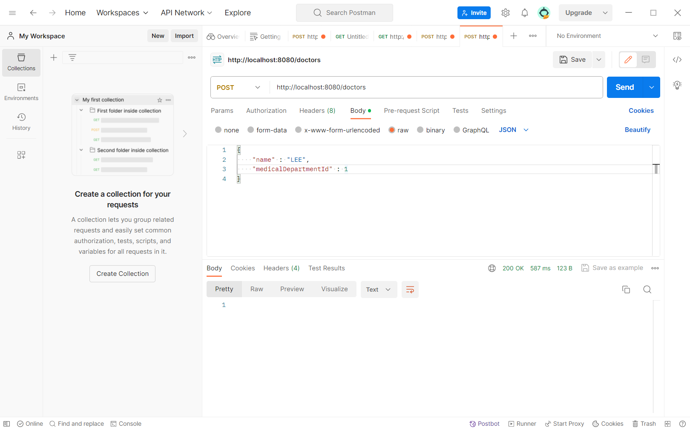
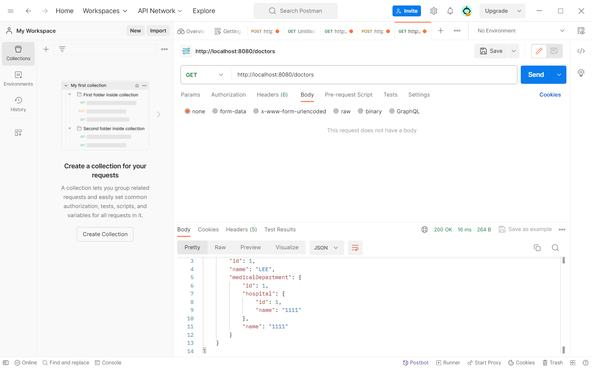
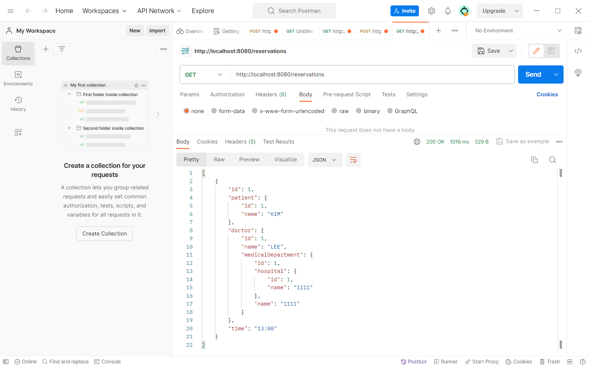

- hospital 객체 생성

- hospital 객체 조회

- medicalDepartment 객체 생성

- medicalDepartment 객체 조회

- patient 객체 생성

- patient 객체 조회

- doctor 객체 생성

- doctor 객체 조회

- reservation 객체 생성

- reservation 객체 조회

